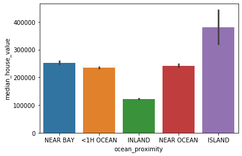
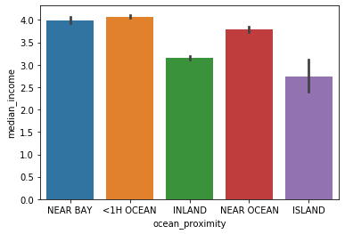

README
================
Sandra Tobon
2020-06-19

# MEDIAN HOUSES VALUE WEST COAST USA

## What is the data set about?

This data set is fictional and is about the median house value in
diferrent areas around the West Coast of the USA. The data set came from a
csv file and had 20640 rows and 10 columns. Those columns are:

  - Latitude  
  - Longitude  
  - Households age  
  - Total rooms  
  - Total bedrooms  
  - Population  
  - Households  
  - Median house income  
  - Median house value  
  - Ocean proximity

## Tools used in this project

  - **Language**: Python  
  - **Libraries**:
      - dfply  
      - pandas  
      - numpy  
      - pandas\_profiling  
      - seaborn  
      - plotnine  
      - statsmodel  
      - matplotlib  
      - sklearn  
      - scipy

## Data Cleaning Process

  - **Values Validation**: Some columns had some invalid values, for
    instance longitude had -1.000000e+18 as value, so I dropped all the
    invalid values. Also, some other columns had valid values that were followed
    by special characters, such as *?*, so I removed those special
    characters too.

  - **Outliers**: The columns total\_rooms, total\_bedrooms, population,
    households, median\_house\_income and median\_house\_value had
    outliers, in this case because I had enough data, I dropped
    them.

  - **Missing Values**: The column total\_bedroom had 180 missing
    values, to populate them I found the mean population per
    bedroom (3), and the mean population per room (5). I used these mean ratios to estimate the total number of bedrooms in each of these locations, and then took the average of these two estimates to populate the missing values.

  - **Cross validation**: In this case I only performed one cross validation
    for the number of people per bedroom. In the west coast of USA
    the maximum number of people allowed to live in a rented bedroom is 2,
    the mean of population per bedroom was 3, so I decided to drop all
    the rows with more than 6 persons per bedroom. Even with this approach I allowed for the possibility to breach the law by several people per bedroom.

## Some useful plots from the data set:

  - The median\_house\_value, varies a lot according to
    ocean\_proximity. The median\_house\_value inland is the lowest and
    the median\_house\_value is the highest in the islands.

  - The median\_house\_income changes a lot between the inland houses and
    the houses closer to the ocean or beach. But it is particulary
    interesting to see how the median income in the houses located on the
    islands is very low even when they have the most expensive houses.
    The reason for this could be that in the island most of the
    population are retired and probably the normal income that they have
    isn’t very high.

## Model

In this case we decided to do a linear model, for this I standardized
all the variables so the comparation was easier. In the first moment, I
only used the features that looked more closely connected with the
median\_houses\_value:

  - median\_income  
  - ocean\_proximity  
  - households\_median\_age  
  - total\_rooms

In the end I couldn’t find a very good model with only those features,
so I decided to do a model with all the features, but even with this I
couldn’t find a very good model with a good fit and spread of residuals.

For the future it would be worthwile trying another model with the purpose of find a way
to predict the median house value.
